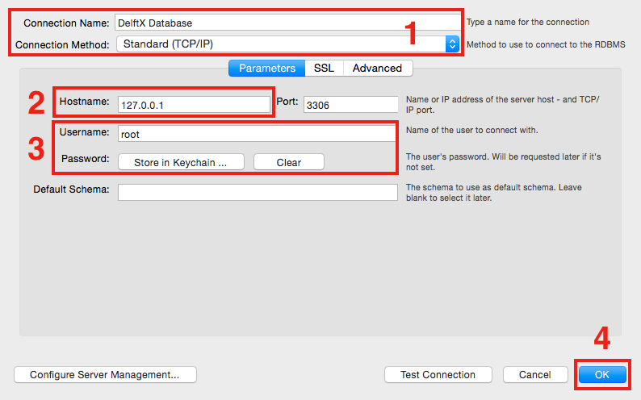

# Steps for Building the Database

## 1. Setting the environment

### 1.1 Download and install [MySQL](http://dev.mysql.com/downloads/mysql/)
### 1.2 Download and install [Python (Version 2.7)](https://www.python.org/downloads/)
### 1.3 Download and install python packages, including: [Connector/Python (Version 2.1.3)](https://dev.mysql.com/doc/connector-python/en/connector-python-installation.html), [pytz](https://pypi.python.org/pypi/pytz?) and [pymongo](https://api.mongodb.com/python/current/). To test whether a package (e.g., ```pytz```) is installed successfully, you may run ```python -c "import pytz"``` in the terminal.

## 2. Uploading the course data

### 2.1 Create a folder named ```course_log``` and a folder named ```daily_logs``` under the ```course_log``` folder (i.e., the path for the ```daily_logs``` folder should be ```$PATH$/course_log/daily_logs/```). After that, upload all of the daily log files (in the form of .gzip) to the ```daily_logs``` folder.
### 2.2 For each course, create a folder under the the ``course_log`` folder named as its course_code (e.g., "FP101x-3T2015" and "EX101x-3T2015"). Within each course folder, 

    *create a folder named as ```metadata``` and upload the following extracted course metadata files here:
		* DelftX-```course_code```-auth_user-prod-analytics.sql
		* DelftX-```course_code```-auth_userprofile-prod-analytics.sql
		* DelftX-```course_code```-certificates_generatedcertificate-prod-analytics.sql
		* DelftX-```course_code```-course_structure-prod-analytics.json
		* DelftX-```course_code```-courseware_studentmodule-prod-analytics.sql

		For courses starting prior to March 2015, we also need to put the following file here.
		* DelftX-```course_code```-prod.mongo

		**This step is very important.**

	*create a folder named as ```surveys``` and upload the following survey files here:
		* anon-ids.csv (storing the mapping between learners' anonymised ID used in Qualtrics and their edX ID)
		* pre-survey.csv (storing learners' responses to the pre-survey)
		* post-survey.csv (storing learners' responses to the post-survey)
	

### 2.3 After performing the above steps, the structure of the ```course_log``` folder should be:

	```
	--  course_log
	    --  daily_Logs
	        --  delftx-edx-events-201X-MM-DD.log.gz
	        --  ...
	    --  FP101x-3T2015
	        --  metadata
	            --  DelftX-FP101x-3T2015-auth_user-prod-analytics.sql
	            --  ...
	        --  surveys
	        	--  anon-ids.csv
	        	--  ...
	    --  EX101x-3T2015
	        --  metadata
	            --  DelftX-EX101x-3T2015-auth_user-prod-analytics.sql
	            --  ...
	        --  surveys
	        	--  anon-ids.csv
	        	--  ...
	```

## 3. Running the scripts

### 3.1 Go to the folder storing the translation codes (i.e., ```$PATH$/DelftX-Daily-Database/```), run the following command to build the DelftX database:

	```mysql -u root -p --local-infile=1 < moocdb.sql```

### 3.2 Editing the config file ```config```

	```
    [mysqld]
	user = root
	password = 123456
	host = 127.0.0.1
	database = DelftX

	[data]
	path = /.../course_log/
	remove_filtered_logs = 0
	log_update_list = ["EX101x-3T2015"]
	metadata_update_list = ["Calc001x-2T2015", "CTB3365DWx-3T2014","EX101x-3T2015"]                        
	survey_update_map = { "Calc001x-2T2015":["13","10"],
					  	  "CTB3365DWx-3T2014":["108","139"],
					      "EX101x-1T2015":["13","10"],
					  	  "EX101x-3T2015":["10","10"],
					      "FP101x-3T2014":["103","118"]                    
                        }
    ```    
    
    * The ```[mysqld]``` section stores required information to establish the database connection. Change the ```user``` and ```password``` to your account.
    * The ```[data]``` section stores required information to process the data, including:
        * The ```path``` points to the ```course_log``` folder (e.g ```$PATH$/course_log/```)
        * The ```remove_filtered_logs``` indicates whether the extracted daily log files generated during the data processing process should be removed (setting to ```1```) or not (setting to ```1```).
        * The ```log_update_list``` stores the course_code of courses in which learners daily activities (e.g., watching videos, solving quizzes, posting in discussion forum) need to be re-imported into the database.
        * The ```metadata_update_list``` stores the course_code of courses whose metadata (e.g., course structure, learners' demographic, learners' certification) needs to be processed (for the first time) or updated. **In other words, if we want to import a new course or update the metadata of a course that have been processed before, we should put the course_code of that course here.**
        * The ```survey_update_map``` stores the course_code of courses (and the indexes of learner's ID in the pre/post surveys in the format of JSON) whose survey data needs to be processed (for the first time) or updated. **In other words, if we want to import a new course or update the survey data of a course that have been processed before, we should put the course_code of that course here.**

### 3.3 Running the translation codes by using following command:

	```python main.py config```

# Database Connection

We recommend to use [MySQL Workbench](http://dev.mysql.com/downloads/workbench/) to build the database connection as detailed below:

### 1. Fill in the connection name and choose ```Standard(TCP/IP)``` as the connection method;
### 2. Fill in the hostname (i.e., IP address of the server in which the database is built);
### 3. Fill in the account information (i.e., username and password) used to visit the database;
### 4. Click the ```OK``` button to connect to the database.

<!---->

<div style="text-align: center">

</div>


# Database Schema

Our database schema is adapted from the [MOOCdb Model](http://moocdb.csail.mit.edu/), which consists of 5 major modules, namely Video Mode, Quiz Mode, Forum Mode, Learner Mode and Survey Mode, as depicted in Figure 1.

<!---->

<div style="text-align: center">

</div>

## 1. Video Mode

The Video Mode has only one table, i.e., video_interaction, which stores the interaction information between learners and course lecture videos.

<!---->

<div style="text-align: center">

</div>

## 2. Quiz Mode

The Quiz Mode has 4 tables, i.e., quiz_questions, submissions, assessments and quiz_sessions.

<!---->

<div style="text-align: center">

</div>


## 3. Forum Mode

The Forum Mode has 2 tables, i.e., forum_interaction and forum_sessions.

<!---->

<div style="text-align: center">

</div>


## 4 Survey Mode

The Survey Mode has 2 tables, i.e., survey_descriptions and survey_responses.

<!---->

<div style="text-align: center">

</div>


## 5. Learner Mode

The Learner Mode has 6 tables, i.e., course_elements, courses, learner_index, sessions, learner_demographic and course_learner.


<!---->

<div style="text-align: center">

</div>


